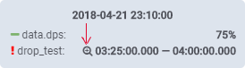
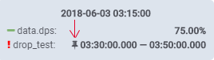

# Hastic Graph Panel

A better version of Grafana's default Graph Panel. Able to render Anomalies & more.


# Prerequisites

* [hastic-server](https://github.com/hastic/hastic-server)
* [Grafana >= 5.1.1](https://grafana.com/grafana/download)

# Installation

- Clone the repository
```
cd $GRAFANA_PATH/data/plugins
git clone git@github.com:hastic/hastic-grafana-graph-panel.git
```

- Restart `$GRAFANA_PATH/bin/grafana-server` server.


# Usage

[hastic-server](https://github.com/hastic/hastic-server) should be running in order to use anomaly detection.

- Open new dasboard where you want to see Hastic panel
- Open Dashboard `Settings` (top right corner) and then navigate to `Variables` 
- Add new [variable](http://docs.grafana.org/reference/templating/#variable-types) 
  - set `type` to `Constant`
  - set `name` to `HASTIC_SERVER_URL` 
  - set `value` to URL of your hastic-server instance in your dashboard (e.g. `http://localhost:8000`)
- Save settings and close Settings window
- Open panel edit mode (click `panel title`menu or press "e" hotkey)
- Navigate to `Metrics` tab. Set metrics. Only one metric suported
- Navigate to `Analytics tab`
  - Push `Add an Anomaly Type` button
  - Set name of the anomaly and choose a pattern type
  - Press `create`
- Label your data:
  - Click button with chart icon
  - Highlight anomalies on graph holding `Ctrl` button on Windows or `Cmd` on Mac
  - When you have finished labeling - click the button with the chart icon once more. `saving...` status should appear.
- `Learning` status should appear while hastic-server is learning (first learning can take a while).
- When `Learning` status dissapears - the anomalies should become labeled in your graph
-  this icon means that the anomaly was marked by the server
-  this icon means that the anomaly was marked by the user


# Development

## Build

```
npm install
npm run build
```


# Changelog

[Improvements]

* You can zoom during update


# Credits

Based on 

* [grafana-plugin-template-webpack-typescript](https://github.com/CorpGlory/grafana-plugin-template-webpack-typescript) 
* [@types/grafana](https://github.com/CorpGlory/types-grafana)
